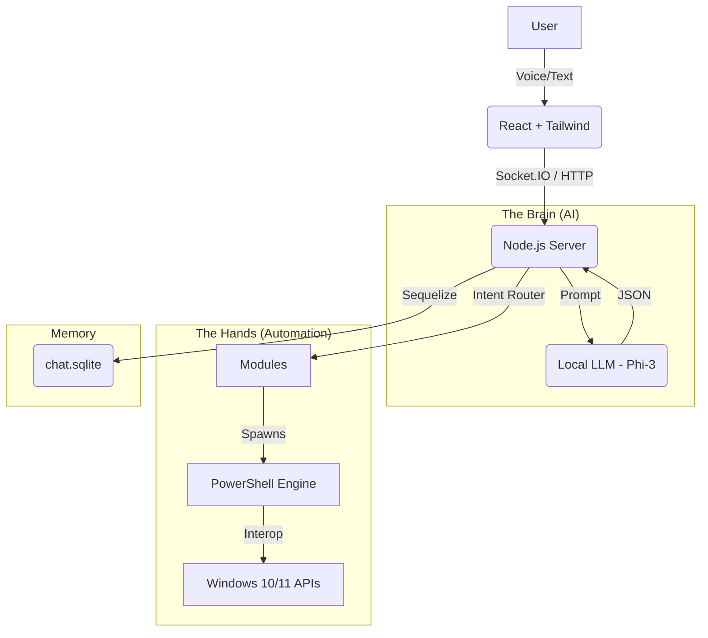

# DIVA System Documentation
> **Digital Intelligent Virtual Assistant**
> *Technical Reference Manual & Developer Guide*
> *Version: 2.0 (Stable)*

---

## 📅 Table of Contents
1.  [Executive Summary](#1-executive-summary)
2.  [System Architecture](#2-system-architecture)
3.  [Installation & Environment](#3-installation--environment)
4.  [The "Brain": AI & Prompt Engineering](#4-the-brain-ai--prompt-engineering)
5.  [Core Automation Modules](#5-core-automation-modules)
    *   [App Control](#51-app-control)
    *   [Window Control](#52-window-control)
    *   [File Control](#53-file-control)
    *   [System Control](#54-system-control)
    *   [Web & Media Control](#55-web--media-control)
6.  [Frontend Application](#6-frontend-application)
7.  [Database & Persistence](#7-database--persistence)
8.  [Troubleshooting Guide](#8-troubleshooting-guide)

---

## 1. Executive Summary

**DIVA** is a localized, privacy-first Windows Automation Agent designed to execute complex desktop tasks via natural language. Unlike cloud-based assistants, DIVA runs entirely on the local machine ("Edge AI"), utilizing a local LLM (`Phi-3`) to interpret intent and `Node.js` + `PowerShell` to execute actions.

**Core Philosophy:** "Determinism over Conversation." Use strict JSON output to ensure 100% executable commands.

---

## 2. System Architecture

The system follows a **Client-Server-Agent** architecture:



### Key Components
1.  **Frontend**: A "Glassmorphism" UI built with React/Vite. Handles Microphone input (Web Speech API) and Text-to-Speech (`window.speechSynthesis`).
2.  **Backend**: Express.js server on Port 5000. Manages sessions, routes AI requests, and executes automation logic.
3.  **AI Engine**: Runs via `Ollama` on Port 11434. Uses the `Phi-3` model (3.8B parameters) for high speed and low latency.

---

## 3. Installation & Environment

### Prerequisites
*   **Operating System**: Windows 10 or 11 (PowerShell 5.1+ required).
*   **Node.js**: Version 18.0.0 or higher.
*   **Ollama**: Installed and running (`ollama serve`).
*   **Model**: `phi3` pulled locally (`ollama pull phi3`).

### Directory Structure
```text
/DIVA
├── ai/                # AI Service & Prompt Logic
├── automation/        # Core Automation Modules
├── backend/           # Node.js Express Server
├── frontend/          # React Client
└── docs/              # Documentation
```

### Environment Variables
No complicated `.env` required by default, but configurable in `config/`:
*   `OLLAMA_HOST`: Defaults to `http://127.0.0.1:11434`
*   `PORT`: Defaults to `5000`

---

## 4. The "Brain": AI & Prompt Engineering

The `/ai/ollamaService.js` file handles all cognitive tasks. We evolved from a "Chatbot" prompt to a "Strict Logic" prompt.

### 4.1 Strict JSON Mode
To prevent "hallucinations" (where the AI chats instead of acting), we enforce:
1.  **Format**: `json` (Ollama API parameter).
2.  **Temperature**: `0.0` (Absolute determinism).
3.  **Stop Tokens**: `["//", "/*", "User:"]` to physically cut off any "thinking out loud" or comments.

### 4.2 The System Prompt
The prompt instructs the AI to classify inputs into categories:
1.  **System Action** (JSON): Open/Close Apps, File Operations.
2.  **Conversation** (Text): Jokes, General Knowledge.

**Example Input:** "Open Calculator"
**Strict Output:**
```json
{
  "type": "system_action",
  "intent": "app_control",
  "entities": {
    "action": "open",
    "target": "Calculator"
  }
}
```

---

## 5. Core Automation Modules

Located in `/automation/modules/`, these contain the specific logic for interpreting intents.

### 5.1 App Control (`appControl.js`)
*   **Function**: Opens, Closes, Restarts apps.
*   **Logic**:
    *   **Startup Scan**: Runs `Get-StartApps` on boot to cache all installed apps.
    *   **Fuzzy Matching**: Uses `dice-coefficient` to match "code" to "Visual Studio Code".
    *   **PowerShell**: Uses `Start-Process` for launching and `Stop-Process` for closing.

### 5.2 Window Control (`windowControl.js`)
*   **Function**: Minimal, Maximize, Snap, Focus.
*   **Advanced Tech**:
    *   **P/Invoke**: Uses `Add-Type` to inject C# code that calls `user32.dll` functions (`ShowWindowAsync`, `SetForegroundWindow`).
    *   **The "Wiggle"**: A technique where we quickly Minimize and Restore a window to force Windows to give it focus (bypassing OS foreground restrictions).

### 5.3 File Control (`fileControl.js`)
*   **Function**: Create, Delete, Listing.
*   **Evolution**:
    *   *v1 (Wizard)*: Asked for Drive letters, maintained state. (Deprecated due to slowness).
    *   *v2 (Classic)*: **Stateless**. "Create Photos" -> Immediately creates on Desktop.
*   **Path Resolution**: Smartly detects "Downloads", "Documents", or "OneDrive\Desktop" based on user keywords.

### 5.4 System Control (`systemControl.js`)
*   **Function**: Volume, Brightness, Lock Screen.
*   **WMI**: Uses `WmiMonitorBrightnessMethods` to control laptop screen brightness.
*   **SendKeys**: Uses `WScript.Shell` to simulate media key presses (Volume Up/Down/Mute).

### 5.5 Web & Media Control (`webControl.js`)
*   **Function**: Website navigation & Spotify/YouTube control.
*   **Spotify Integration**:
    *   Uses `spotify:` protocol URI to launch playlists.
    *   Simulates `Spacebar` keypress to toggle Play/Pause.
*   **YouTube**:
    *   "I'm Feeling Lucky": Search `site:youtube.com [query]` and click the first result to auto-play videos instantly.

---

## 6. Frontend Application

Built with **React 18** and **Vite**.

### 6.1 State Management
*   **`messages`**: Array of chat objects (`{sender: 'user', text: '...'}`).
*   **`sessions`**: List of persistent chat histories pulled from the backend.
*   **`ttsState`**: Tracks if the bot is Speaking, Paused, or Idle.

### 6.2 Real-time Communication
*   **Socket.IO**: Used for streaming Voice Input (STT) status and receiving Bot Responses asynchronously.
*   **Axios**: Used for CRUD operations on Sessions (Load, Delete, Rename).

### 6.3 UI Architecture
*   **Styling**: Valid CSS + Tailwind Utility Classes.
*   **Theme**: "Cyberpunk/Neon" (Dark Mode #121212 with #00ffcc Accents).
*   **Sidebar**: Collapsible, manages Chat Sessions (New, Load, Delete, Rename).

---

## 7. Database & Persistence

DIVA remembers.

*   **Database Engine**: **SQLite** (file: `backend/database.sqlite`).
*   **ORM**: **Sequelize**.
*   **Schema**:
    *   **Chat**:
        *   `id`: Primary Key.
        *   `sessionId`: Integer (Groups messages into conversations).
        *   `role`: 'user' or 'bot'.
        *   `message`: The content.
        *   `timestamps`: `createdAt`, `updatedAt`.

---

## 8. Troubleshooting Guide

### 8.1 "Port 5000 In Use"
*   **Symptom**: Server crashes on start with `EADDRINUSE`.
*   **Cause**: A previous `node server.js` process is still running (Zombie process).
*   **Fix**: Run `taskkill /F /IM node.exe` in terminal.

### 8.2 "AI Hallucinations" (Raw Code Output)
*   **Symptom**: User sees JSON code like `{ type: ... }` in the chat bubble.
*   **Cause**: The AI output contained comments (`//`) which broke the JSON parser.
*   **Fix**: Ensure `ollamaService.js` has `stop: ["//"]` enabled.

### 8.3 "App Not Found"
*   **Symptom**: "Open Photoshop" says "Could not find Photoshop".
*   **Cause**: The app isn't in `Get-StartApps` (common for portable apps).
*   **Fix**: Manually add the alias to `APP_ALIASES` in `appControl.js`.

---
*© 2026 DIVA Project Team*
