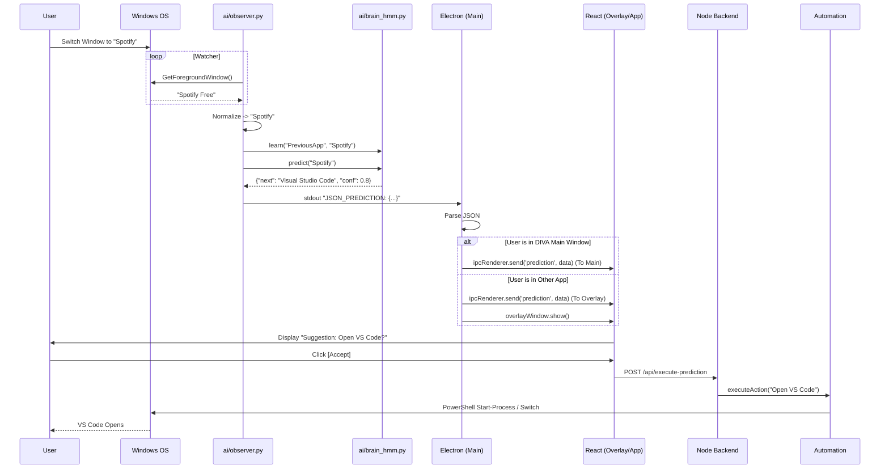
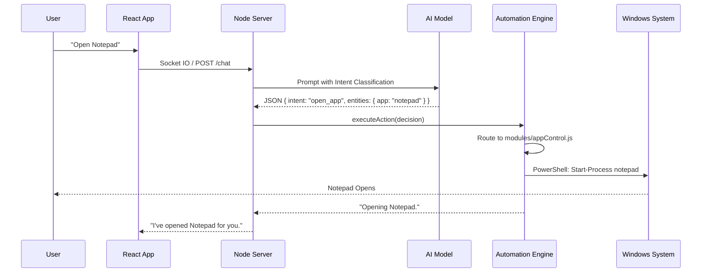

# DIVA System Architecture

**Documentation Generated:** 2026-02-19
**Version:** 2.0 (Electron Migration)

## 1. High-Level Overview

**DIVA (Desktop Intelligent Virtual Assistant)** is a hybrid desktop application built on **Electron**. It combines a modern **React** frontend with a powerful **Node.js** backend and **Python** AI microservices.

### Key Goals:
*   **Unified Experience:** Single executable managing UI, Backend, and AI processes.
*   **Deep System Integration:** Ability to control Windows apps, files, and system settings via PowerShell.
*   **Context Awareness:** Tracks user activity to predict next actions using a Hidden Markov Model (HMM).
*   **Multimodal Input:** Supports Text, Voice, and System Events (Window changes).

---

## 2. Directory Structure & Key Files

### 📂 `root` (e:\DIVA)
*   `package.json`: Project manifest. Defines dependencies and the `start` script (`concurrently "npm run dev" "electron ."`).
*   `start_diva.bat`: Legacy batch script (mostly superseded by `npm start`).

### 📂 `electron/` (The Application Shell)
This layer manages the application lifecycle and native window management.

*   **`main.js`**: **The Core Controller.**
    *   **Process Management:** Spawns the Node.js Backend (`server.js`) and Python AI (`observer.py`) as child processes.
    *   **Window Management:** Creates two distinct windows:
        1.  **Main Window:** Large, standard window hosting the Dashboard (`/`).
        2.  **Overlay Window:** Small, transparent, always-on-top window hosting the Prediction Popup (`/overlay`).
    *   **IPC Hub:** Acts as a bridge between the Frontend (React) and the Background Processes (Python/Node). It reads `stdout` from Python, parses JSON predictions, and routes them to the appropriate window via `ipcMain` / `webContents.send`.

### 📂 `frontend/` (The User Interface)
Built with **React (Vite)** and **Tailwind CSS**.

*   **`src/main.jsx`**: Application Entry Point. Uses `HashRouter` to manage routing within the Electron file system context.
    *   Route `/`: Renders `<App />` (Main Dashboard).
    *   Route `/overlay`: Renders `<Overlay />` (Floating Widget).
    *   Route `/settings`: Renders `<Settings />`.

*   **`src/App.jsx`**: **Main Dashboard Logic.**
    *   Manages Chat Interface (History, Input).
    *   Connects to Backend via `Socket.IO` for real-time updates.
    *   Listens for `ipcRenderer` 'prediction' events to display inline suggestions.
    *   Handles Voice Input toggling.

*   **`src/Overlay.jsx`**: **Prediction Widget.**
    *   A lightweight, transparent component designed to float over other apps.
    *   Listens for 'prediction' events designated for the overlay.
    *   Handles User Feedback (Accept/Reject):
        *   **Accept:** Sends IPC 'feedback' -> Main Process AND calls Backend API `/api/execute-prediction` to perform the action.
        *   **Reject:** Dismisses the popup.

### 📂 `backend/` (The Brain & Automation Hub)
A **Node.js (Express)** server that handles logic, data persistence, and system control.

*   **`server.js`**: **API & Socket Server.**
    *   Exposes REST endpoints (`/sessions`, `/chat`, `/api/execute-prediction`).
    *   Manages SQLite database via Sequelize.
    *   Integrates `ollamaService` for LLM processing.
    *   Integrates `automation/index.js` to execute system commands.
    *   Receives Voice Input from `voiceService.js`.

*   **`config/database.js`**: **Database Connection.**
    *   Configures `sequelize` to use `database.sqlite`.

*   **`models/`**:
    *   **`Session.js`**: Defines chat sessions (Title, Timestamp).
    *   **`Chat.js`**: Defines individual chat messages (Role, Content, SessionID).

### 📂 `ai/` (The Intelligence Layer)
Microservices written in Python (for AI/ML libraries) and Node wrappers.

*   **`observer.py`**: **The "Eyes" (Window Tracker).**
    *   Uses `ctypes` to poll the active window title.
    *   **Normalization:** Cleans raw titles (e.g., "DIVA - Antigravity..." -> "Visual Studio Code") to ensure consistent data.
    *   **Event Loop:** Debounces rapid switching (waits for stable focus).
    *   **Integration:** Calls `BrainHMM` to log activity and get predictions.
    *   **Output:** Prints `JSON_PREDICTION: {...}` to stdout, which Electron reads.

*   **`brain_hmm.py`**: **The "Brain" (Prediction Engine).**
    *   **Algorithm:** 1st-Order Hidden Markov Model (HMM).
    *   **Learning:** Builds a Transition Matrix (A -> B count) from `activity_logs` in SQLite.
    *   **Prediction:** Given current state A, finds B with the highest probability.
    *   **Sanitization:** Cleans historical data on load to match Observer's normalization.

*   **`voiceService.js`**: Node wrapper for Voice.
    *   Spawns **`ears.py`**.
*   **`ears.py`**: **The "Ears".**
    *   Uses `Vosk` (Offline Speech Recognition) to listen to the microphone.
    *   Emits "RECOGNIZED: text" to stdout for Node to capture.

*   **`ollamaService.js`**:
    *   Connects to local Ollama instance (Llama 3) to generate chat responses.

### 📂 `automation/` (The Hands)
Executes system actions via PowerShell.

*   **`index.js`**: **Command Dispatcher.**
    *   Parses "Intent" from the LLM or Prediction.
    *   Routes command to the correct module.

*   **`modules/`**:
    *   **`appControl.js`**: **Application Management.**
        *   **Smart Launch:** Checks if app is running. If yes, switches focus (`windowControl.forceFocusWindow`). If no, launches new process.
        *   Maintains a list of aliases (e.g., "code" -> "Visual Studio Code").
    *   **`windowControl.js`**:
        *   Handles Minimize, Maximize, Restore, Focus.
        *   Uses robust PowerShell scripts to interact with Win32 APIs.
    *   **`systemControl.js`**: Volume, Brightness, Power.
    *   **`webControl.js`**: Opens URLs, searches Google/YouTube.
    *   **`fileControl.js`**: File operations (Create, Delete, Read).
    *   **`noteControl.js`**: Note-taking logic.

*   **`utils/powershell.js`**:
    *   Helper function to spawn PowerShell processes and return their output/JSON.

---

## 3. Data Flow Diagrams

### A. Prediction Loop (The "HMM" Cycle)
The user switches windows, causing a chain reaction that results in a UI suggestion.

### B. Chat Command Flow
User types or speaks a command.

