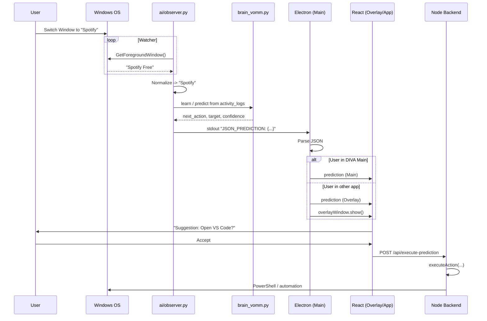
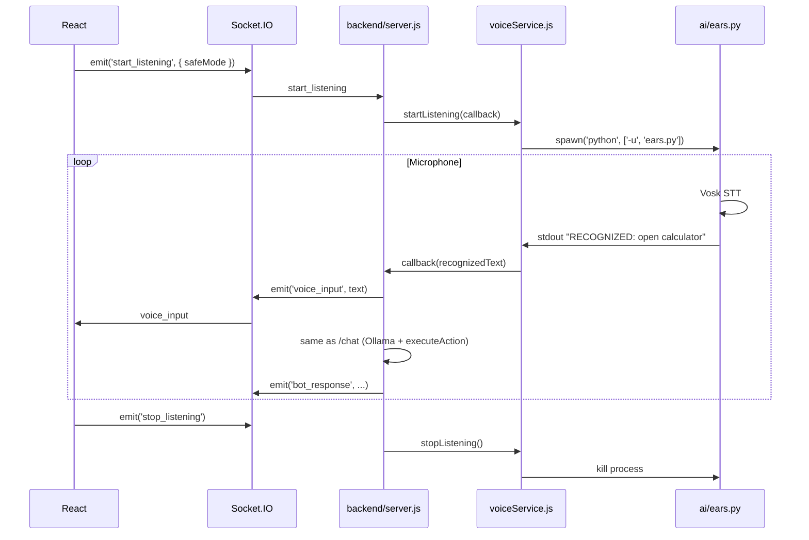

# DIVA System Architecture

**Document Version:** 3.0  
**Last Updated:** 2026-03-12  
**Scope:** Full project analysis — Electron, Frontend, Backend, AI, Automation, Database.

---

## 1. High-Level Overview

**DIVA (Desktop Intelligent Virtual Assistant)** is a hybrid desktop application built on **Electron**. It combines a **React (Vite)** frontend with a **Node.js (Express)** backend, **Python** AI/voice microservices, and a **PowerShell-based automation** layer for deep Windows integration.

### Design Goals

| Goal | How It’s Achieved |
|------|-------------------|
| **Unified experience** | Single Electron app spawns frontend dev server, Node backend, and Python observer; one executable in production. |
| **Deep system integration** | Automation layer runs PowerShell to control apps, windows, volume, brightness, power, files, web, and notes. |
| **Context awareness** | Python observer tracks active window; Variable-Order Markov Model (VOMM) predicts next action from `activity_logs`. |
| **Multimodal input** | Text (chat), voice (Vosk STT via `ears.py`), and system events (window-focus predictions). |
| **Fast repeated commands** | Semantic cache (Ollama embeddings + cosine similarity) bypasses LLM for similar past commands. |

### One-Line Architecture

**User** ↔ **Electron (Main + Overlay)** ↔ **React (Vite)** ↔ **Backend (Express + Socket.IO)** ↔ **SQLite**, **Ollama**, **Voice (Python)**, **Automation (PowerShell)**; **Electron** also reads **observer.py** stdout for predictions.

---

## 2. Directory Structure & Responsibilities

```
e:\DIVA\
├── package.json              # Root app; main = electron/main.js; start = Vite + Electron
├── requirements.txt          # Python deps: vosk, sounddevice, psutil
├── electron/                 # Desktop shell
│   └── main.js               # Process spawn, windows, IPC, prediction routing
├── frontend/                 # React UI
│   ├── index.html
│   ├── src/
│   │   ├── main.jsx          # Entry; HashRouter: /, /overlay
│   │   ├── App.jsx           # Chat, sessions, voice, Socket.IO, IPC
│   │   ├── Overlay.jsx       # Prediction popup; Accept → execute-prediction
│   │   └── SettingsModal.jsx # Settings; localStorage + IPC
│   ├── vite.config.js
│   └── tailwind.config.cjs
├── backend/                  # Brain hub
│   ├── server.js             # Express API, Socket.IO, DB, Ollama, voice, automation
│   ├── database.sqlite       # SQLite DB file
│   ├── config/database.js    # Sequelize SQLite connection
│   ├── models/
│   │   ├── Session.js
│   │   ├── Chat.js
│   │   ├── SemanticCache.js
│   │   └── Note.js
│   ├── utils/embedding.js    # Ollama nomic-embed-text + cosine similarity
│   └── seedCache.js          # npm run seed — prefill semantic cache
├── ai/                       # Intelligence & voice
│   ├── observer.py           # Window watcher; VOMM; stdout JSON_PREDICTION
│   ├── ears.py               # Vosk STT; stdout RECOGNIZED: text
│   ├── brain_vomm.py         # Variable-Order Markov (used by observer)
│   ├── brain_hmm.py          # HMM (optional/legacy)
│   ├── ollamaService.js      # queryOllama(), generateTitle(); /api/chat, /api/generate
│   └── voiceService.js       # Spawns ears.py; parses stdout; callback to server
└── automation/               # System actions
    ├── index.js              # executeAction(decision, rawQuery); router
    ├── modules/
    │   ├── appControl.js     # Open/close/restart apps; Start menu cache; aliases
    │   ├── windowControl.js  # Minimize, maximize, focus, show desktop
    │   ├── systemControl.js  # Volume, brightness, power, lock, sleep
    │   ├── webControl.js     # URLs, search, YouTube, Spotify, media keys
    │   ├── fileControl.js    # Create/delete files and folders
    │   └── noteControl.js    # Notes/reminders
    └── utils/
        ├── powershell.js     # runPowerShell(), runPowerShellData()
        └── matching.js       # Fuzzy match (e.g. app names)
```

---

## 3. Tech Stack by Component

| Layer | Technology |
|-------|------------|
| **Desktop shell** | Electron |
| **Frontend** | React 19, Vite 7, React Router 7, Tailwind CSS, Axios, Socket.IO client |
| **Backend** | Node.js, Express 5, Socket.IO, Sequelize, SQLite3 |
| **LLM & embeddings** | Ollama (local): phi3 (chat/generate), nomic-embed-text (embeddings) |
| **Voice** | Python: Vosk, sounddevice; Node: voiceService.js (spawn + stdout bridge) |
| **Observer / prediction** | Python: ctypes (Win32), sqlite3, BrainVOMM |
| **Automation** | Node child processes → PowerShell (Windows) |
| **Fonts / assets** | Google Fonts (Material Symbols, Inter, Fira Code) via index.html |

---

## 4. Component Deep-Dive

### 4.1 Electron (`electron/main.js`)

- **Lifecycle:** On `app.ready`, spawns:
  - **Node backend:** `node backend/server.js` (port 5000).
  - **Python observer:** `python -u ai/observer.py` (long-running).
- **Windows:**
  - **Main:** Chat UI; in dev loads `http://localhost:5173`, in prod `frontend/dist/index.html`.
  - **Overlay:** Frameless, transparent, always-on-top; route `/#/overlay`; shown when prediction targets “other app”.
- **IPC (ipcMain):**
  - `update-settings` — apply alwaysOnTop, transparency, minimizeToTray, smartPredictions.
  - `show-overlay` / `hide-overlay` — overlay visibility.
  - `feedback` — user Accept/Reject of prediction (used by Overlay).
- **Prediction pipeline:** Reads Python stdout; looks for line `JSON_PREDICTION: {...}`; parses JSON and sends to renderer via `webContents.send('prediction', data)`. Sends to main window or overlay based on focus.
- **Tray:** System tray icon; open/quit.

### 4.2 Frontend (React + Vite)

- **Entry:** `index.html` → `main.jsx` (HashRouter).
- **Routes:**
  - `/` → `App.jsx` (main chat dashboard).
  - `/overlay` → `Overlay.jsx` (prediction widget).
- **App.jsx:**
  - Chat list, session list, input, voice toggle.
  - HTTP (axios) to `http://localhost:5000`: GET/PUT/DELETE sessions, POST /chat.
  - Socket.IO: `start_listening` / `stop_listening`; receives `voice_input`, `bot_response`, `session_updated`.
  - Listens for IPC `prediction` to show inline suggestions.
- **Overlay.jsx:**
  - Listens for IPC `prediction`; shows Accept/Reject.
  - **Accept:** POST `/api/execute-prediction` with prediction payload + IPC `feedback`.
  - **Reject:** Dismiss only.
- **SettingsModal.jsx:** User/settings form; persisted in localStorage; sent to Electron via IPC.

### 4.3 Backend (`backend/server.js`)

- **HTTP server:** Express on port **5000**; same server hosts Socket.IO.
- **REST API:**

| Method | Path | Purpose |
|--------|------|---------|
| GET | `/sessions` | List all sessions (sidebar). |
| GET | `/sessions/:id` | Get messages for a session. |
| PUT | `/sessions/:id` | Rename session. |
| DELETE | `/sessions/:id` | Delete session (chats CASCADE). |
| POST | `/chat` | User message → semantic cache / Ollama → executeAction → response. |
| POST | `/api/execute-prediction` | Run suggested action from overlay/main (same automation path). |

- **Socket.IO:**
  - `start_listening` (optional `{ safeMode }`) → `voiceService.startListening(callback)`; callback runs same AI + execute path as `/chat`, then emits `voice_input`, `bot_response`, `session_updated`.
  - `stop_listening` → kills Python ears process.
- **Chat pipeline (POST /chat):**
  1. Create session if no `sessionId`.
  2. Save user message to DB and in-memory `activeChatHistory[sessionId]` (rolling 6 messages).
  3. **Semantic cache:** Exact text match first; else embed with Ollama `nomic-embed-text`, cosine similarity vs `SemanticCache`; if ≥ 0.98 and not conversational, use cached decision (skip LLM).
  4. On cache miss: `queryOllama(text, ramHistory)` → Ollama `/api/chat` (phi3) → JSON decision.
  5. If `system_action` / `web_search` / `file_action` or has `intent`: safe-mode check for sensitive commands; then `executeAction(decision, text)`.
  6. Save bot response; update session; return JSON.
- **Idle worker:** When idle, generates session titles via Ollama for sessions with `isTitleGenerated: false`; preempted when user sends a message.

### 4.4 AI Layer

- **ollamaService.js (Node):**
  - `queryOllama(text, ramHistory)` → `http://127.0.0.1:11434/api/chat` (model: phi3); returns parsed JSON decision.
  - `generateTitle(messages)` → `/api/generate` for session title.
- **embedding.js (backend):** `getTextVector(text)` → Ollama `/api/embeddings` (nomic-embed-text); `cosineSimilarity(a, b)` for cache lookup.
- **observer.py (Python):**
  - Polls active window (Win32); normalizes title; writes to SQLite `activity_logs`; runs VOMM prediction; prints `JSON_PREDICTION: {...}` to stdout for Electron.
- **ears.py (Python):** Vosk STT; prints `RECOGNIZED: <text>` to stdout.
- **voiceService.js (Node):** Spawns `python -u ai/ears.py`; parses stdout; on `RECOGNIZED:` line calls backend callback with text (same pipeline as /chat).

### 4.5 Automation (`automation/index.js`)

- **Single entry:** `executeAction(decision, rawQuery)`.
- **Input:** `decision` from Ollama or overlay (intent/type, entities); `rawQuery` for fuzzy fallbacks.
- **Logic:** Normalize intent/entities; optional overrides (e.g. system/window); route by intent to:
  - **systemControl** — power, lock, sleep, volume, brightness.
  - **windowControl** — show desktop, minimize, maximize, focus window.
  - **appControl** — open/close/restart apps (Start menu cache, aliases, fuzzy match; focus if already running).
  - **webControl** — open URL, search, YouTube, Spotify URI, media keys.
  - **fileControl** — create/delete file or folder.
  - **noteControl** — notes/reminders.
- **Shared:** `utils/powershell.js` for running PowerShell; `utils/matching.js` for fuzzy matching.

---

## 5. Database Schema

- **Engine:** SQLite; file `backend/database.sqlite`; accessed via Sequelize; no migrations (schema from `sequelize.sync()` in `server.js`).

| Model | Table | Key Fields | Purpose |
|-------|--------|------------|---------|
| **Session** | Sessions | id, title, isTitleGenerated, createdAt, updatedAt | Chat sessions. |
| **Chat** | Chats | id, role, message (TEXT), sessionId (FK → Sessions), createdAt, updatedAt | Messages; Session hasMany Chat, onDelete CASCADE. |
| **SemanticCache** | SemanticCaches | text (unique), vector (JSON string), action (JSON string) | Semantic cache for fast command reuse. |
| **Note** | Notes | content (TEXT), timestamps | Defined in models; not referenced in server.js. |

**Python observer** uses the same SQLite file and maintains:

| Table | Purpose |
|-------|---------|
| **activity_logs** | id, timestamp, action_type, action_value, accepted; window-focus events for VOMM training and prediction. |

---

## 6. External Services & Configuration

| Service | Endpoint / Usage | Notes |
|---------|-------------------|------|
| **Ollama** | `http://127.0.0.1:11434` | Required. `/api/chat`, `/api/generate`, `/api/embeddings`. Models: phi3, nomic-embed-text. |
| **Frontend (dev)** | `http://localhost:5173` | Vite dev server. |
| **Backend** | `http://localhost:5000` | Express + Socket.IO; port hardcoded. |

- **Environment:** `dotenv` in backend package.json but not required in `server.js`; no `.env` usage in code. Port and Ollama URL are hardcoded.
- **Platform:** Automation and observer target **Windows** (PowerShell, Get-StartApps, ctypes/user32, COM for media keys).

---

## 7. Data Flow Diagrams

### 7.1 Prediction Loop (VOMM → Overlay / Main)



### 7.2 Chat & Voice Command Flow

```mermaid
sequenceDiagram
    participant User
    participant UI as React App
    participant Server as Node Server
    participant Cache as SemanticCache
    participant Ollama as Ollama
    participant Automation as automation/
    participant System as Windows

    User->>UI: "Open Notepad" (text or voice)
    UI->>Server: POST /chat or Socket voice_input path
    Server->>Server: saveMessage; updateChatHistory
    Server->>Cache: exact match or embedding + cosine similarity
    alt Cache hit (≥0.98)
        Cache-->>Server: cached decision
    else Cache miss
        Server->>Ollama: /api/chat (phi3) + ramHistory
        Ollama-->>Server: JSON decision
        Server->>Cache: save new command (if action)
    end
    Server->>Server: safeMode check if sensitive
    Server->>Automation: executeAction(decision, text)
    Automation->>Automation: route to appControl/windowControl/...
    Automation->>System: PowerShell
    System-->>User: Notepad opens
    Automation-->>Server: result message
    Server->>Server: saveMessage(bot); update session
    Server-->>UI: response; session_updated (Socket if voice)
```

### 7.3 Voice Listening Flow



---

## 8. Integration Points Summary

| From | To | Mechanism | Purpose |
|------|----|-----------|---------|
| Electron | Backend | Spawn `node backend/server.js` | Run API and Socket server. |
| Electron | Observer | Spawn `python ai/observer.py`; read stdout | Window tracking and predictions. |
| Frontend | Backend | HTTP (axios), Socket.IO | Sessions, chat, execute-prediction, voice. |
| Frontend | Electron | IPC (ipcRenderer / ipcMain) | Settings, prediction events, overlay show/hide, feedback. |
| Backend | SQLite | Sequelize | Sessions, Chats, SemanticCache. |
| Backend | Ollama | HTTP (127.0.0.1:11434) | Chat, title generation, embeddings. |
| Backend | Voice | voiceService → spawn ears.py | Bridge RECOGNIZED text into chat/action pipeline. |
| Backend | Automation | require + executeAction() | Run system/app/window/file/web/note actions. |
| Observer | SQLite | sqlite3 (activity_logs) | VOMM training and context. |
| Observer | Electron | stdout JSON_PREDICTION | No direct backend call; Electron forwards to UI. |
| Automation | Windows | PowerShell child processes | All system actions. |

---

## 9. Security & Safe Mode

- **Sensitive commands:** Shutdown, restart, reboot, turn off, delete, etc. can be gated by **safe mode** (frontend sends `safeMode` in /chat or Socket config).
- When `safeMode && !bypassSafeMode` and the request is classified sensitive, the backend returns `{ requiresConfirmation: true }` instead of executing; the UI can then ask for explicit confirmation and retry with `bypassSafeMode`.

---

## 10. File Reference Quick Index

| Concern | Primary File(s) |
|---------|------------------|
| App entry, process spawn, windows, IPC | `electron/main.js` |
| Chat UI, sessions, voice toggle, Socket | `frontend/src/App.jsx` |
| Prediction popup, execute on Accept | `frontend/src/Overlay.jsx` |
| REST + Socket + chat pipeline + voice | `backend/server.js` |
| DB connection | `backend/config/database.js` |
| Session/Chat/SemanticCache/Note | `backend/models/*.js` |
| Embeddings, cosine similarity | `backend/utils/embedding.js` |
| Ollama chat & title | `ai/ollamaService.js` |
| Voice bridge | `ai/voiceService.js`; `ai/ears.py` |
| Window tracking, VOMM, predictions | `ai/observer.py`; `ai/brain_vomm.py` |
| Action routing & execution | `automation/index.js`; `automation/modules/*.js` |
| PowerShell runner | `automation/utils/powershell.js` |

---

*This document was generated from full project analysis. For setup and run instructions, see `docs/SETUP_GUIDE.md`.*
